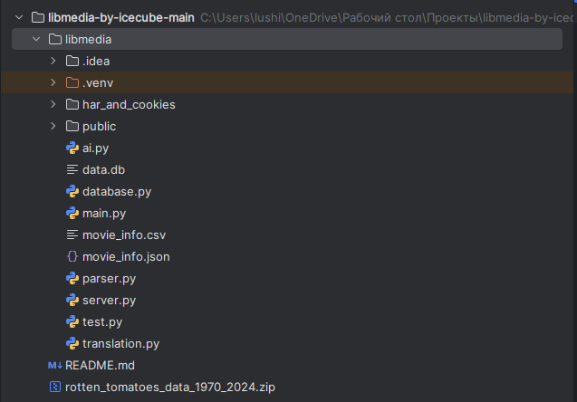
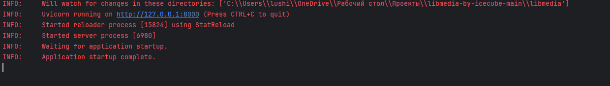

# **Libmedia**

#### Версия Python: 3.13

### Веб-сервис для поиска фильмов и сериалов по описанию

## Установка библеотек ^_^

#### Чтобы установить все библеотеки необходимые для работы веб-сервиса впишите команду в консоль

```bash
pip install -r requirements.txt
```

## Запуск (●'◡'●)

#### Чтобы запустить проект выберите файл _server.py_ и запустите

#### _P.S. в инструкции IDE - это PyCharm, для других IDE интерфейс может отличаться_




#### Затем дождитесь следующего сообщения в консоли:



### Готово! Можете переходить на веб-сайт по ссылке в консоли.